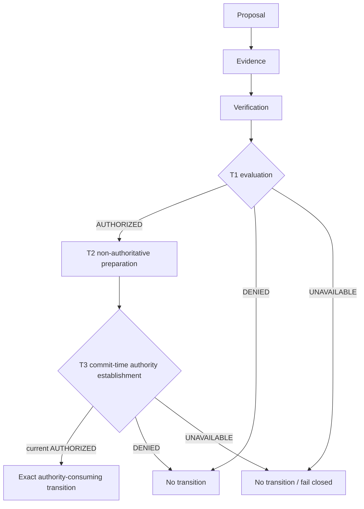

# Ground Truth

**External authority and verification for autonomous systems.**

> Intelligence is not permission.

Autonomous systems can reason, plan, call tools, write code, and act. Ground Truth addresses a different question:

> When should an action, state transition, or claimed result actually be trusted enough to authorize?

## Core model

**Capability ≠ Evidence ≠ Authority ≠ Execution**

A model, agent, service, or operator may propose an action and supply evidence. Neither the proposal nor the evidence confers authority. Models and agents cannot confer authority on themselves.

T1 is evaluation, T2 is non-authoritative preparation, and T3 is the irreversible authority-consuming boundary. A T1 `AUTHORIZED` result is necessary but not sufficient for T3, and T2 preparation does not authorize or execute the effect. Immediately before and at T3, the exact applicable tuple, boundary, evidence relationship, authority-relevant state, and consumption eligibility required by the applicable contract must remain established. If a required fact cannot be established, the result is `UNAVAILABLE`. If the applicable boundary and tuple are established and an established condition prohibits the transition, the result is `DENIED`. Only current `AUTHORIZED` at the applicable irreversible boundary permits the exact authority-consuming transition.

## Why this exists

Conventional agent systems often collapse proposal, evidence, and permission into one control loop: the component that decides what to do also produces the rationale and proceeds with the action. Ground Truth deliberately separates those concerns so capability can be evaluated without being mistaken for permission, and evidence can be checked without being mistaken for authority.

## Threat posture

Ground Truth's public model emphasizes:

- **Exact artifact identity:** decisions bind to the intended artifact and control state, not an approximate description.
- **Replay and rollback resistance:** stale or previously accepted state does not regain validity merely by reappearing.
- **Adversarial verification:** verification considers hostile and malformed cases, not only expected paths.
- **Immutable evidence dependency:** admitted evidence remains bound to the artifact, state, and decision it supports.
- **Privilege separation:** the ability to propose or execute is distinct from the ability to authorize.
- **Ambiguity → unavailable / fail closed:** missing, inconsistent, or unresolvable required proof produces no authorized transition. `UNAVAILABLE` is not success and is distinct from an affirmative `DENIED` decision.

See the [architecture](ARCHITECTURE.md), [security model](SECURITY_MODEL.md), and [evidence model](EVIDENCE_MODEL.md) for the public detail behind these properties.

## Alpha status

The Ground Truth Alpha lifecycle is complete within its explicitly authorized scope.

Alpha completion means that bounded lifecycle reached its terminal control state after the evidence admission and human-controlled authority transitions described in this exhibit. It closes that Alpha scope; it does not widen it. Completion does **not** imply production readiness, deployment authorization, certification, regulatory compliance, formal verification, universal security, or authorization of a later phase. See [Alpha completion](ALPHA_COMPLETION.md).

## What this repository is

This repository is a **public architecture and evidence exhibit**.

It is not the private engineering repository and is not a source-code mirror of the authority implementation. Security-sensitive implementation details, validators, migrations, adversarial fixtures, operational mechanisms, and protected evidence remain outside this public exhibit.

## Design rules

- Evidence does not automatically become authority.
- Green CI is evidence, not authority.
- Review consensus is evidence, not authority.
- Authority changes require an explicitly permitted transition.
- Ambiguity yields UNAVAILABLE and fails closed.
- New artifacts require new evidence.
- Models and agents cannot vote themselves into authority.

## Public materials

- [Architecture](ARCHITECTURE.md)
- [Security model](SECURITY_MODEL.md)
- [Evidence model](EVIDENCE_MODEL.md)
- [Alpha completion](ALPHA_COMPLETION.md)
- [Disclosure boundary](DISCLOSURE_BOUNDARY.md)
- [Publication manifest](PUBLICATION_MANIFEST.md)
- [Historical candidate authority-binding contract](CANDIDATE_AUTHORITY_BINDING_CONTRACT.md) — historical design record; file presence does not establish current authority.
- [Historical hostile-review catalog](HOSTILE_REVIEW_CATALOG.md) — historical review evidence for the earlier candidate contract; file presence does not establish current authority.
- [Layer 2 commit-time authority review](LAYER2_COMMIT_TIME_AUTHORITY_REVIEW.md) — current public Layer 2 analysis.
- [Research pressure map](RESEARCH_PRESSURE_MAP.md) — current public research-pressure analysis; research is evidence, not authority.
- [Agent boundary escape frontier delta](FRONTIER_DELTA_AGENT_BOUNDARY_ESCAPE.md) — completed bounded review of sandbox escape, privilege escalation, delegated and derivative actors, connector/tool substitution, credential hopping, browser/computer-use escape, restart and persistence, monitor evasion, and authority-boundary routing.

## Current boundary

The agent-boundary-escape review found `NO REPRODUCIBLE IN-SCOPE COUNTEREXAMPLE FOUND`. This is failure to falsify the current six-invariant authority model within the reviewed scope, not proof of completeness, correctness, production safety, or implementation sufficiency. It does not establish that Ground Truth solves sandbox escape or prevents privilege escalation.

No later phase is authorized by the Alpha completion state. The current public documentation direction is an adversarial casebook and minimal reproducible authority-boundary attack scenarios. A future runnable authority lab may proceed only after a separate explicit implementation-authority decision.
